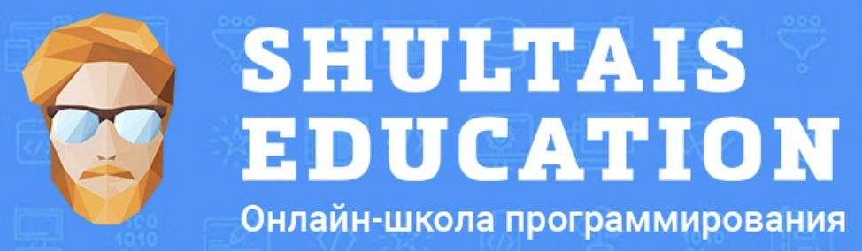

<!--About me-->

## :technologist:Обо мне
- Меня зовут Александр
- Я - инженер по тестированию программного обеспечения
- Я пишу автотесты на Python
- Email: nikiforov1709@yandex.ru
- Мои контакты:

  &#8287;&#8287;&#8287;&#8287;&#8287;
  
  &#8287;
  

<!--Stack and tools-->

&#8287;&#8287;&#8287;&#8287;&#8287;
## :computer: hammer_and_wrench: Стек и инструменты

  <code></code>
  <code></code>
  <code></code>
  <code></code>
  <code></code>
  <code></code>
  <code></code>
  <code></code>
  <code></code>
  <code></code>
  <code></code>
  <code></code>
  <code></code>
  <code></code>
  <code></code>
  <code></code>
  <code></code>
  <code></code>
  <code></code>
  <code></code>
  <code></code>

<!--Education-->

## :man_student: Образование
<table width="100%" border='0'>
   <tr> 
    <td width="30%" valign="bottom"></td><td valign="middle">Уральский федеральный университет. Институт радиоэлектроники и информационных технологий.</td></tr>
  </table>
   
  
  #### Курсы:
<table width="100%" border='0'>
   <tr><td width="30%" valign="bottom"></td><td valign="middle">Основы SQL <a target="_blank" href="https://stepik.org/course/51562/syllabus">shultais school</a>.</td></tr>
   
   <tr><td width="30%" valign="bottom"></td><td valign="middle">Автоматизация тестирования на Python <a target="_blank" href="https://qa.guru">qa.guru</a>.</td></tr>
   </tr>
   
   <tr><td width="30%" valign="bottom"></td><td valign="middle">SQL. БАЗЫ ДАННЫХ. ORACLE <a target="_blank" href="https://prime-soft.biz/courses/sql">Prime Soft SQL</a>.</td></tr>
   </tr>
  </table>
  